# Fact Knowledge Layer

A generic knowledge layer that extracts meaningful numerical and semantic facts from PDF documents, links every fact back to its source evidence, normalizes values and context, and identifies relationships between facts across documents.

Built as an engineering assignment for the **Superjoin VIT 2026 Engineering Intern Hiring Challenge**.


**Demo video:** [Watch the 3-minute demo](https://drive.google.com/file/d/160wd9Dgbj_8hFEEx9CQp6COCJW7y4D-V/view?usp=sharing)

Live Demo:
https://superjoin-fact-knowledge-ui.onrender.com

## Project Presentation

The complete project presentation covering the problem, architecture, extraction strategy, relationship reasoning, demonstrated cases, engineering trade-offs, limitations, and generalization is available below.

[View the Project Presentation](Superjoin_Fact_Knowledge_Layer_Presentation.pptx)

---

## 1. Problem

Organizations often have important facts distributed across multiple PDF documents.

For example:

- One document may report a company's revenue.
- Another may report the same metric using different wording.
- A later report may contain a different value because it covers a different period or scope.
- Some statements may not contain enough context to safely determine whether two values agree or conflict.

The goal of this project is to build a reusable **Fact Knowledge Layer** that can:

1. Ingest one or more PDFs.
2. Extract meaningful numerical and semantic facts.
3. Preserve the evidence supporting each fact.
4. Normalize values and units where possible.
5. Compare facts across documents.
6. Identify:
   - Corroboration
   - Contradiction
   - Contextual difference
   - Uncertain cases
7. Avoid making unsupported claims when evidence is insufficient.

The system is designed to work with additional PDFs without requiring document-specific schemas or hard-coded facts.

---

## 2. Architecture

```text
                         PDF Documents
                              |
                              v
                     +------------------+
                     |    PDF Parser    |
                     +------------------+
                              |
                              v
                     +------------------+
                     |     Chunker      |
                     +------------------+
                              |
                              v
                 +------------------------+
                 | Candidate Detection    |
                 +------------------------+
                              |
                       +------+------+
                       |             |
                       v             v
                +-------------+  +----------------+
                | LLM         |  | Deterministic |
                | Extractor   |  | Fallback      |
                +-------------+  +----------------+
                       |             |
                       +------+------+
                              |
                              v
                     +------------------+
                     | Fact Validation |
                     +------------------+
                              |
                              v
                     +------------------+
                     | Evidence Linking|
                     +------------------+
                              |
                              v
                     +------------------+
                     |  Normalization   |
                     +------------------+
                              |
                              v
                     +------------------+
                     |  Fact Matching   |
                     +------------------+
                              |
                              v
                  +----------------------+
                  | Relationship Engine  |
                  +----------------------+
                              |
                              v
                  +----------------------+
                  | Knowledge Layer / UI |
                  +----------------------+
```

### Design Principle

The LLM is **not responsible for the entire system**.

It is treated as an optional semantic extraction component.

The rest of the pipeline — validation, evidence verification, normalization, matching, and relationship reasoning — remains deterministic and independent of the LLM provider.

This makes the system more resilient to:

- API failures
- rate limits
- quota exhaustion
- malformed model responses
- missing API credentials
- ambiguous extraction

---

## 3. Fact Representation

Facts use a generic schema rather than a document-specific schema.

```python
class Fact(BaseModel):
    entity: Optional[str] = None
    metric: str
    value: Optional[Union[float, str]] = None
    unit: Optional[str] = None
    period: Optional[str] = None
    scope: Optional[str] = None
    evidence: str
    page_number: int
    source_document: str
```

### Example

```json
{
  "entity": "Company",
  "metric": "revenue",
  "value": 100,
  "unit": "₹ million",
  "period": "FY2024",
  "scope": "company",
  "evidence": "The company reported revenue of ₹100 million for FY2024.",
  "page_number": 12,
  "source_document": "annual_report.pdf"
}
```

The schema is intentionally generic so that the same representation can support metrics such as:

- revenue
- employees
- customers
- capacity
- GDP
- imports
- exports
- inflation
- debt
- profit/loss
- growth rates

without requiring a separate schema for each document.

---

## 4. Evidence Linking

Every extracted fact is linked to its source evidence.

The system stores:

- source document
- page number
- evidence text
- extracted metric
- value
- unit
- period
- scope

Before a fact is accepted, the extracted evidence is verified against the original PDF chunk.

This prevents the extraction layer from returning facts whose supporting evidence does not actually occur in the source text.

### Evidence Verification

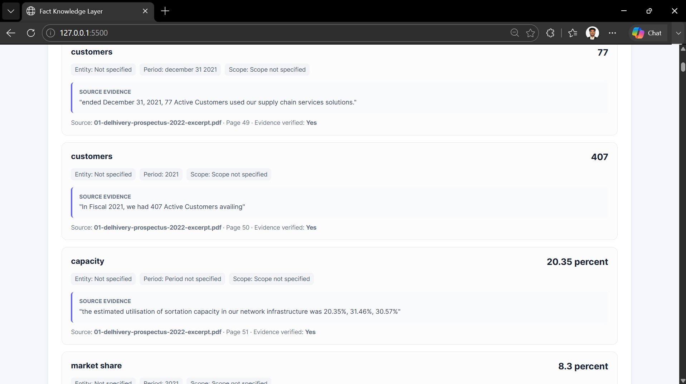

The interface exposes the extracted fact together with its source evidence and page information so that the result can be traced back to the original document.

---

## 5. Relationship Reasoning

The relationship engine compares facts after normalization and context analysis.

### Relationship Overview

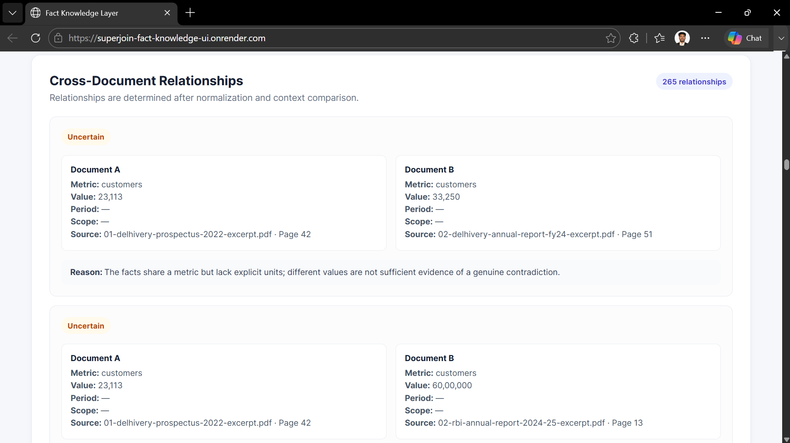

The relationship layer compares facts across documents while considering normalized values, units, reporting periods, scope, entities, and semantic context.

---

### 5.1 Corroboration

When two facts describe the same metric, comparable context, and the same normalized value:

```text
Document A:

Revenue was ₹100 million for FY2024.

Document B:

The company reported revenue of ₹100 million for FY2024.

                         ↓

Relationship:

CORROBORATION
```

Example result:

```json
{
  "relationship": "corroboration",
  "normalized_value_a": 100000000,
  "normalized_value_b": 100000000
}
```

The relationship engine also handles wording differences by comparing normalized fact fields and semantic context rather than requiring identical evidence text.
### Corroboration Detection


This demonstrates the cross-document relationship view used to identify corroborating facts despite wording differences.
---

### 5.2 Contradiction

A contradiction is reported only when the facts have sufficiently compatible context but materially different values.

```text
Document A:

Revenue = ₹100 million
FY2024

Document B:

Revenue = ₹150 million
FY2024

                         ↓

Relationship:

CONTRADICTION
```

Example result:

```json
{
  "relationship": "contradiction",
  "normalized_value_a": 100000000,
  "normalized_value_b": 150000000
}
```

The engine does not classify every differing number as a contradiction.

### Contradiction Detection

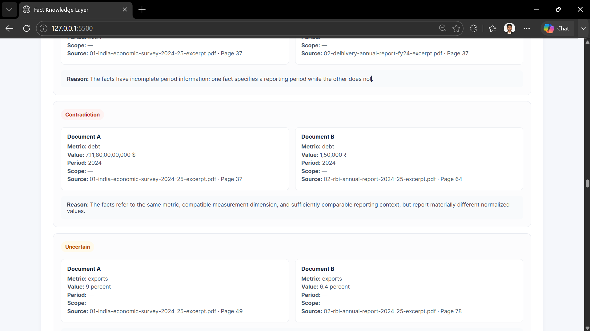

This validation case demonstrates the relationship engine flagging a materially different value when the available context supports comparison.

---

### 5.3 Contextual Difference

Different values can be valid when the surrounding context differs.

For example:

```text
Permanent employees:

23,381

Female employees:

5,594
```

These values should not automatically be considered contradictory because they can describe different populations or reporting contexts.

The engine therefore supports a:

```text
contextual_difference
```

relationship.

Context markers considered by the reasoning layer include concepts such as:

- female / male
- permanent / temporary / contract
- domestic / international
- export / import
- consolidated / standalone
- segment / subsidiary
- quarterly / annual / YTD
- per day / month / year
- per employee / customer
- reporting periods

The engine is deliberately conservative when context is incomplete.

### Contextual Difference Detection

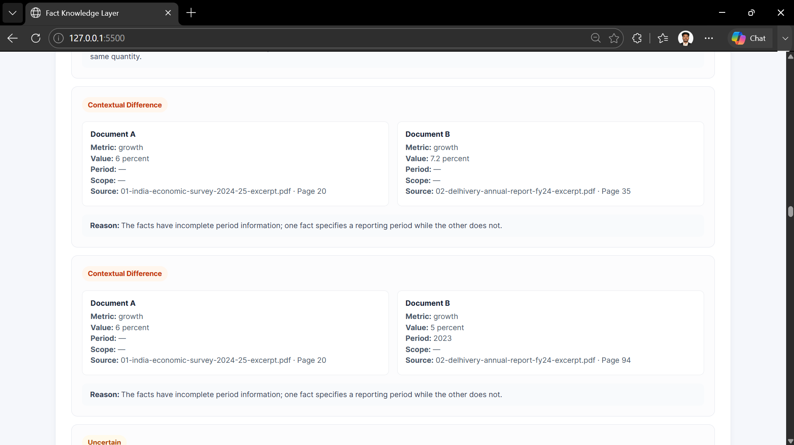

This screenshot demonstrates that differing values can be retained as a contextual difference rather than being incorrectly classified as a contradiction.

---

### 5.4 Uncertain / Failure Handling

If two facts have different values but insufficient context to safely determine whether they contradict each other, the system returns:

```text
uncertain
```

Example:

```text
Customers: 23,113

Customers: 33,250

Context:

No explicit unit
No reliable period
No reliable scope
```

Instead of inventing a contradiction, the system returns:

```json
{
  "relationship": "uncertain"
}
```

This is an intentional design decision.

> When evidence is insufficient, the system prefers uncertainty over unsupported reasoning.

### Uncertain Relationship

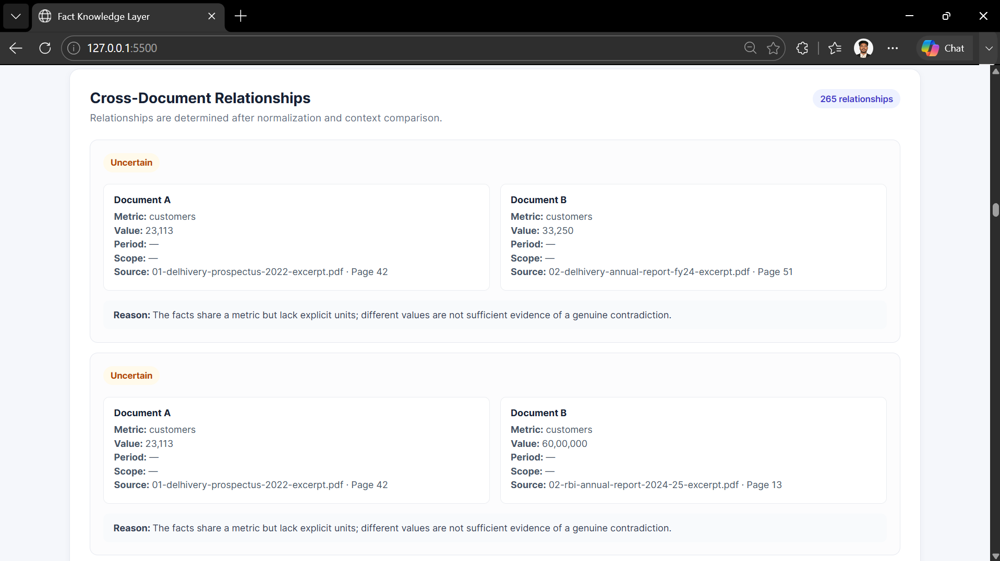

This demonstrates the conservative relationship classification when two facts cannot be safely compared because the available context is insufficient.

### Extraction Failure Handling

The system also preserves the source evidence and page information when an extraction candidate is suspicious or ambiguous, allowing the result to be inspected rather than silently treating an incorrect number as trustworthy.

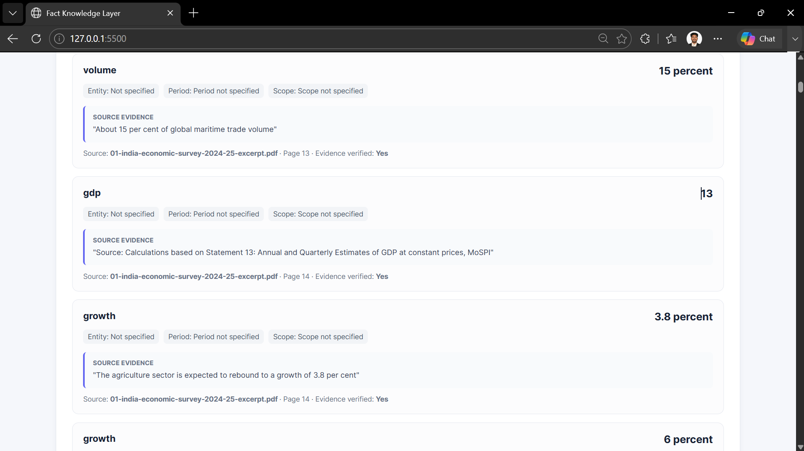

---

## 6. Extraction Strategy

The extraction pipeline uses two complementary approaches.

### Deterministic Fallback

The fallback extractor identifies structured numerical and semantic statements using generic patterns.

It handles cases such as:

- numbers with units
- percentages
- currencies
- growth statements
- revenue / expense / profit statements
- employee counts
- customer counts
- capacity
- economic indicators
- common table-style statements

The fallback contains generic guards for common extraction traps such as:

- table-of-contents numbers
- section references
- chart labels
- formula/index notation
- denominator values in ratios
- percentage-of-GDP statements
- share-of-total statements
- fiscal-year date components
- accounting reconciliation values

These rules are based on linguistic and structural context rather than specific document filenames or hard-coded source facts.

### Optional LLM Extraction

For more difficult semantic phrasing, the system can use an LLM as an extraction aid.

The LLM output is still validated against the original PDF chunk before becoming a trusted fact.

If the LLM fails because of:

- rate limiting
- quota exhaustion
- malformed JSON
- provider errors
- unavailable credentials

the pipeline falls back to deterministic extraction rather than failing the entire ingestion process.

---

## 7. Batch Processing

Documents are processed in chunks rather than loading an entire PDF into one model request.

This provides:

- bounded prompt size
- better evidence locality
- support for larger PDFs
- incremental processing
- easier failure recovery

LLM extraction is performed in small batches.

If one batch fails, the affected batch can fall back to deterministic extraction, and provider failures can disable further LLM calls while allowing the remaining document processing to continue.

### PDF Processing


The processing interface shows the PDF ingestion and processing workflow.

### Processed Documents


The application maintains the processed document set as part of the knowledge-layer workflow.

---

## 8. API

The backend is implemented using **FastAPI**.

The API supports PDF ingestion and exposes the resulting knowledge-layer information to the frontend.

The application is separated into:

```text
backend/app/

├── api/
├── extraction/
├── models/
├── reasoning/
└── storage/
```

Important modules include:

```text
extraction/

    pdf_parser.py
    chunker.py
    fact_extractor.py
    batch_processor.py
    batch_fact_extractor.py
    candidate_detector.py
    fallback_extractor.py
    llm_client.py

reasoning/

    evidence_verifier.py
    fact_normalizer.py
    fact_matcher.py
    fact_deduplicator.py
    relationship_engine.py
```

---

## 9. Frontend

The frontend is a lightweight HTML/CSS/JavaScript interface.

It allows users to:

1. Select PDF documents.
2. Upload and process documents.
3. Build the knowledge layer.
4. Inspect extracted facts and their relationships.

The frontend intentionally avoids unnecessary framework complexity for this prototype.

### Live Hosted Application

**Frontend:**  
https://superjoin-fact-knowledge-ui.onrender.com

**Backend API:**  
https://superjoin-fact-knowledge-api.onrender.com

### Hosted Dashboard

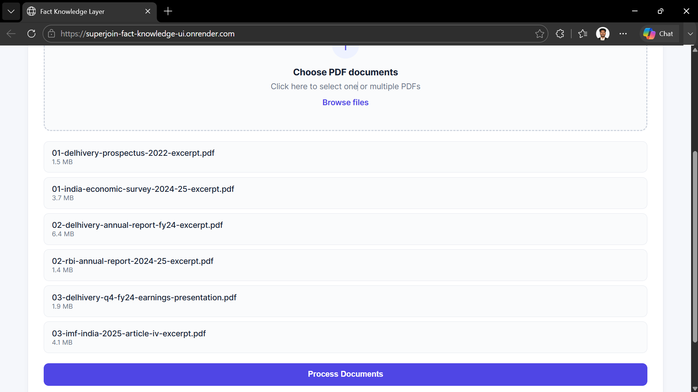

The deployed application provides the same PDF ingestion and knowledge-layer inspection workflow through the hosted frontend.

### Hosted Multi-Document View

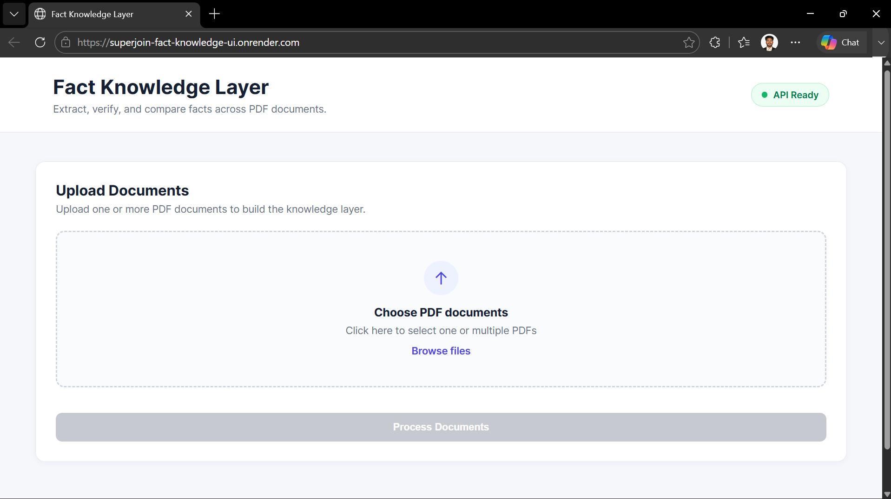

The hosted validation demonstrates processing and inspecting multiple PDF documents through the deployed application.

---

## 10. Running the Project

### Prerequisites

- Python 3.10+
- Git
- A modern web browser

### Backend

From the project root:

```powershell
cd backend

python -m venv venv

.\venv\Scripts\activate

pip install -r requirements.txt

uvicorn app.main:app --reload
```

The backend will be available at:

```text
http://127.0.0.1:8000
```

### Frontend

Open another terminal:

```powershell
cd frontend

python -m http.server 5500
```

Then open:

```text
http://127.0.0.1:5500
```

---

## 11. Testing

The project includes unit and integration tests covering:

- PDF parsing
- candidate detection
- deterministic extraction
- fact normalization
- fact matching
- fact deduplication
- relationship classification
- multi-document processing
- batch extraction
- API behavior
- pipeline integration

Run the complete test suite:

```powershell
python -m pytest backend/tests -q
```

Current validation:

```text
86 passed, 1 warning
```

### Automated Test Validation

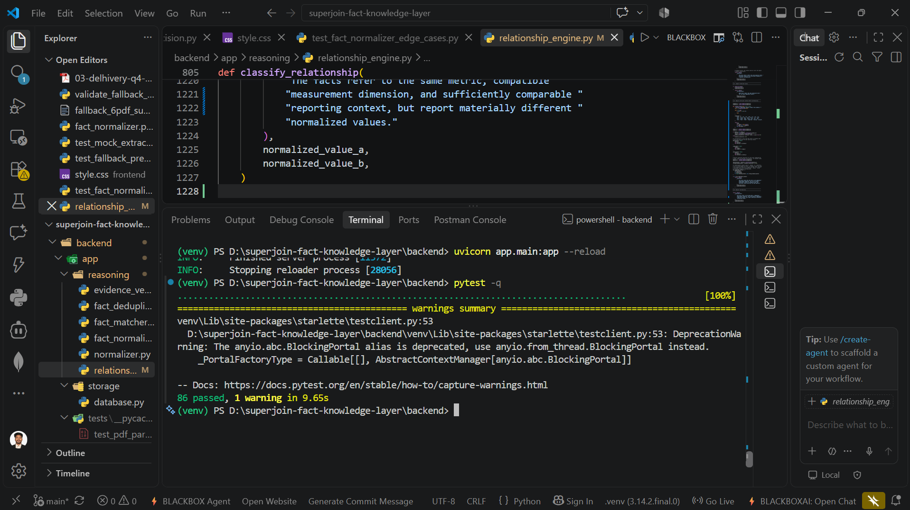

The complete automated test suite currently passes with 86 tests.

The relationship engine was also manually validated against the four core reasoning scenarios:

```text
Corroboration          → corroboration
Genuine contradiction  → contradiction
Contextual difference  → contextual_difference
Insufficient context   → uncertain
```

### Six-PDF Validation

The system was additionally validated against a six-document PDF set covering company reports, economic reports, and financial/economic publications.

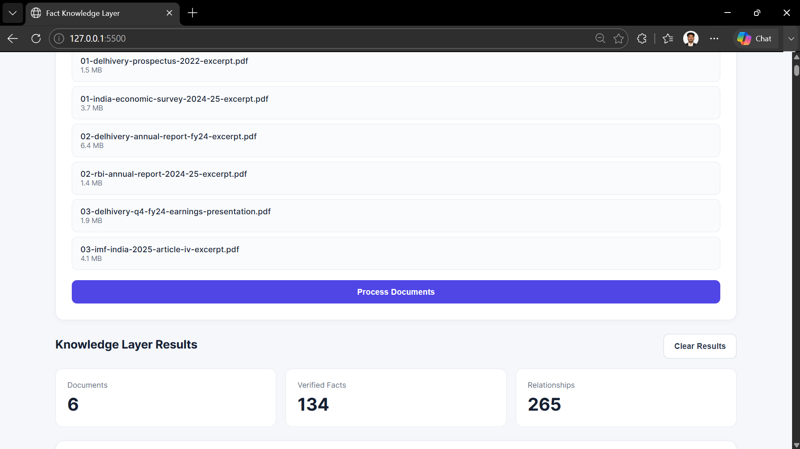

This validates the multi-document ingestion and cross-document reasoning workflow.

---

## 12. Genericity

The system does not depend on:

- specific PDF filenames
- hard-coded facts
- fixed document schemas
- document-specific relationship rules
- a graph database
- a particular LLM provider

New PDFs can be introduced through the same ingestion pipeline.

The fact representation and reasoning layer remain independent of the source document.

---

## 13. Design Decisions and Tradeoffs

### Deterministic Fallback Instead of LLM-Only Extraction

**Decision:** Keep deterministic extraction as a reliable fallback.

**Why:** External LLM APIs can have rate limits, quotas, outages, or malformed outputs.

**Tradeoff:** Deterministic extraction is less capable of understanding highly complex language than a strong LLM.

---

### Evidence Verification

**Decision:** Verify extracted evidence against the original chunk.

**Why:** A fact without trustworthy evidence is not useful in a knowledge layer.

**Tradeoff:** Additional validation adds processing overhead.

---

### Conservative Relationship Classification

**Decision:** Use `uncertain` when context is insufficient.

**Why:** False contradictions are more harmful than explicitly unresolved comparisons.

**Tradeoff:** Some genuinely related facts may remain unresolved until additional context is available.

---

### Lightweight Frontend

**Decision:** Use plain HTML/CSS/JavaScript.

**Why:** The assignment focuses on the knowledge layer rather than frontend framework complexity.

**Tradeoff:** Less sophisticated UI architecture than a full frontend framework.

---

## 14. Failure Handling

The system is designed to degrade gracefully.

| Failure | Handling |
| ------------------------------ | -------------------------------------- |
| Invalid PDF | Parser/API error |
| Empty page | Skipped safely |
| LLM unavailable | Deterministic fallback |
| LLM rate limit | Disable further LLM calls and continue |
| Invalid LLM JSON | Batch fallback |
| Evidence mismatch | Fact rejected |
| Missing context | `uncertain` relationship |
| Different reporting periods | Contextual difference |
| Different semantic populations | Contextual difference |

The objective is not to force a conclusion for every input, but to produce a trustworthy result when sufficient evidence exists.

### Failure Handling Demonstration


The failure-handling validation demonstrates that suspicious extraction does not need to become an unsupported conclusion. Evidence and provenance are retained for inspection.

---

## 15. Limitations

This is a focused engineering prototype rather than a production-scale document intelligence platform.

Current limitations include:

- Highly ambiguous prose may still produce uncertain or imperfect deterministic facts.
- Complex tables and charts can require specialized table/vision extraction.
- Semantic interpretation is weaker when no LLM is available.
- Context inference is intentionally conservative.
- Some domain-specific concepts may require additional ontology or entity resolution.
- Large-scale persistent storage and distributed processing are outside the prototype scope.

These limitations are preferable to silently generating unsupported facts.

---

## 16. Future Improvements

Potential next steps include:

- stronger entity resolution
- richer temporal reasoning
- table-aware PDF extraction
- OCR/image-based extraction
- confidence scores for individual facts
- human review workflows
- persistent database-backed storage
- incremental document ingestion
- larger-scale asynchronous processing
- stronger semantic similarity models
- provenance graphs for complex evidence chains

---

## 17. AI Tools Used

AI assistance was used during development for:

- code review and debugging
- test generation
- extraction-pattern analysis
- reasoning logic design
- API troubleshooting
- documentation drafting

The system itself does not require an LLM to function because deterministic fallback extraction is built into the architecture.

---

## 18. Demo

**Demo video:** [Watch the 3-minute demo](https://drive.google.com/file/d/160wd9Dgbj_8hFEEx9CQp6COCJW7y4D-V/view?usp=sharing)

The demo will show:

1. PDF upload
2. Fact extraction
3. Evidence and page linking
4. Cross-document corroboration
5. Genuine contradiction
6. Contextual difference
7. Uncertain/failure handling

### Demo Evidence

#### Dashboard

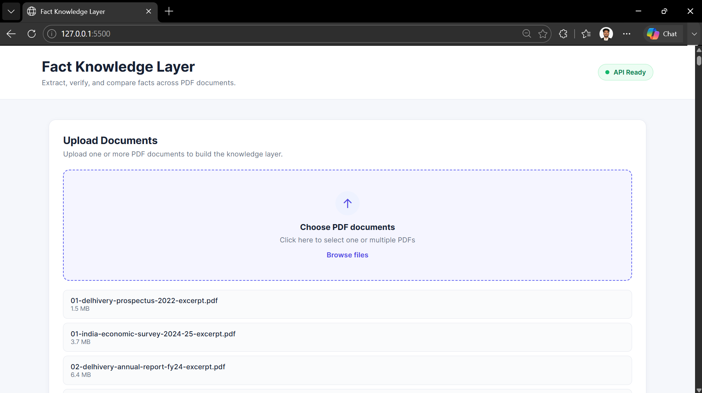

#### Relationships


#### Evidence

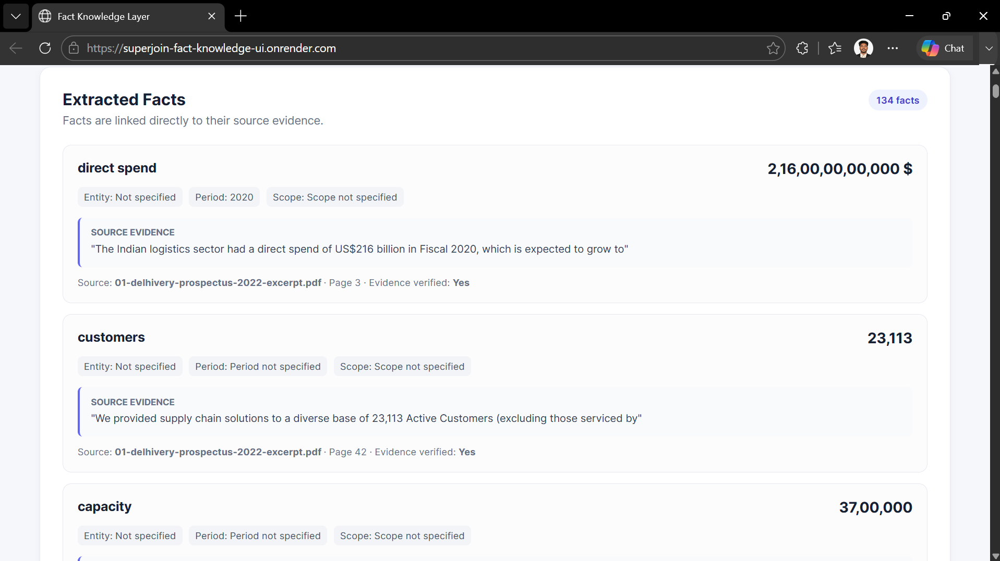

#### PDF Processing


#### Processed PDFs


#### Multi-PDF Dashboard


---

## 19. Project Structure

```text
superjoin-fact-knowledge-layer/
│
├── backend/
│   ├── app/
│   │   ├── api/
│   │   ├── extraction/
│   │   ├── models/
│   │   ├── reasoning/
│   │   └── storage/
│   │
│   ├── tests/
│   └── requirements.txt
│
├── frontend/
│
├── data/
│
├── docs/
│
├── screenshots/
│   ├── 01-dashboard-6-pdfs.png
│   ├── 02-fact-evidence-verification.png
│   ├── 03-uncertain-relationship.png
│   ├── 04-contextual-difference.png
│   ├── 05-contradiction.png
│   ├── 06-failure-handling.png
│   ├── 07-tests-86-passed.png
│   ├── DASHBOARD.png
│   ├── FINAL 3.png
│   ├── FINAL 3.1.png
│   ├── FINAL 3.2.png
│   ├── FINAL 3.3.png
│   ├── FINAL 3.4.png
│   ├── FINAL PIC 1.png
│   ├── FINAL PIC 1.1.png
│   ├── FINAL PIC 2.png
│   ├── FINAL PIC 2.1.png
│   ├── FINAL PIC 2.2.png
│   ├── d1.png
│   ├── dashboardhost.png
│   ├── evidence.png
│   ├── pdf processing.png
│   ├── processed pdfs.png
│   └── relationships.png
│
├── .gitignore
├── docker-compose.yml
└── README.md
```

---

## 20. Additional Validation Screenshots

The repository contains additional screenshots documenting the development, deployment, and validation stages of the prototype.

### Final Dashboard


### Final Validation 3


### Final Validation 3.1


### Final Validation 3.2


### Final Validation 3.3


### Final Validation 3.4


### Final Validation — Picture 1


### Final Validation — Picture 1.1


### Final Validation — Picture 2


### Final Validation — Picture 2.1


### Final Validation — Picture 2.2


---

## 21. Summary

The project implements a generic fact knowledge layer that combines:

```text
PDF parsing

    +

candidate detection

    +

LLM / deterministic extraction

    +

evidence verification

    +

normalization

    +

fact matching

    +

context-aware relationship reasoning
```

The core principle is:

> **Extract facts, preserve provenance, compare normalized values with context, and remain uncertain when the evidence is insufficient.**